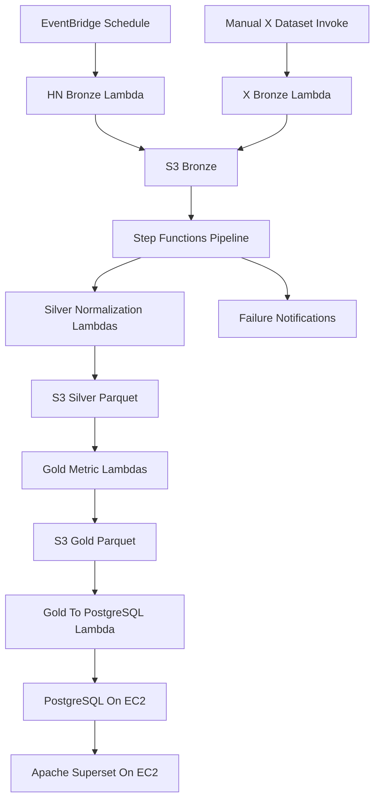

# Full Implementation Team Plan

## Goal

Implement the full project from `PROJECT_SPECIFICATION.md`: bronze ingestion, silver normalization, gold metrics/KPIs, PostgreSQL/Superset visualization, failure notifications, VPC/networking, and Terraform IaC.

The existing bronze work remains the foundation:

- Hacker News source: `lambda/hacker_news/`
- X/Twitter source: `lambda/x/`
- Terraform foundation: `infra/`

## Architecture



## Shared Contracts

Use these S3 prefixes:

```text
s3://<data-lake-bucket>/bronze/
s3://<data-lake-bucket>/silver/
s3://<data-lake-bucket>/gold/
```

Suggested silver tables:

- `users`: normalized users across Hacker News and X.
- `posts`: normalized posts/comments/tweets/jobs/polls.
- `post_relationships`: optional parent-child/comment relationships if needed for HN `children`/nested structures.

Suggested gold tables:

- `daily_hn_item_counts`
- `daily_users_metric`
- `top_x_users_by_followers`
- `top_hn_users_by_karma_high`
- `top_hn_users_by_karma_low`
- `top_hn_jobs_by_score`
- `top_hn_stories_by_score`
- `data_quality_score`

Shared environment variables:

- `BRONZE_BUCKET` / `DATA_LAKE_BUCKET`
- `BRONZE_PREFIX`, `SILVER_PREFIX`, `GOLD_PREFIX`
- `TARGET_DATE`, `INGESTION_DATE`
- `POSTGRES_HOST`, `POSTGRES_DB`, `POSTGRES_USER`, `POSTGRES_PASSWORD_SECRET_ARN`
- `NOTIFICATION_WEBHOOK_SECRET_ARN`

## Collaboration Model

Each person should touch all core technologies:

- Terraform/IaC
- Python Lambda/data code
- S3 Medallion layer design
- Tests/validation
- PostgreSQL/Superset or notification integration
- Documentation

Avoid one person owning only Terraform, only Python, or only dashboards.

## Milos: Orchestration, Networking, and Gold Export Slice

Milos owns the shared orchestration path and the final bridge from gold S3 outputs into PostgreSQL.

Tasks:

- Extend `infra/` with VPC, subnets, route tables, security groups, and least-privilege network rules.
- Add Step Functions state machine for the full pipeline: bronze completion, silver normalization, gold transformation, PostgreSQL load, failure notification.
- Add Terraform resources for shared Lambda layers or packaging conventions used by silver/gold Lambdas.
- Implement `gold_to_postgres` Lambda that reads gold metric outputs and upserts them into PostgreSQL.
- Define PostgreSQL table DDL/migration scripts for the gold metric tables.
- Add Secrets Manager resources for PostgreSQL credentials and notification webhook references.
- Document deployment, state machine execution, and PostgreSQL loading.

Deliverables:

- Terraform VPC/networking resources.
- Step Functions state machine and IAM role.
- PostgreSQL EC2/security group wiring or shared networking needed by PostgreSQL.
- Gold-to-PostgreSQL Lambda.
- PostgreSQL schema scripts.
- Integration docs for running the full pipeline.

Verification:

- `terraform fmt`, `terraform validate`, `terraform plan` pass.
- Step Functions execution can reach each placeholder/real task.
- PostgreSQL loader test works against a local or test PostgreSQL instance if available.
- Loader proves at least one gold metric table is inserted/upserted.

## Vukan: Silver Normalization and Hacker News Deep Slice

Vukan owns silver normalization, with extra responsibility for Hacker News-specific raw shape and nested structures.

Tasks:

- Implement silver normalization Lambda(s) under a new path such as `lambda/silver/`.
- Normalize Hacker News bronze data into shared `users`, `posts`, and optional relationship tables.
- Normalize X dataset into the same shared schema where possible.
- Flatten Hacker News nested/relationship fields enough for downstream metrics.
- Normalize timestamps to UTC ISO-8601.
- Clean HTML from text fields.
- Remove duplicates by stable source IDs.
- Write silver outputs as partitioned Parquet datasets using `awswrangler`/`pyarrow`.
- Add Terraform resources for silver Lambda(s), IAM permissions, and any Lambda layer needed for Parquet dependencies.
- Add tests for timestamp normalization, HTML cleaning, deduplication, schema mapping, and partition-key generation.

Deliverables:

- Silver normalization Python modules and Lambda handler(s).
- Silver S3 layout and schema documentation.
- Terraform for silver Lambda(s), layer/package, and S3 permissions.
- Tests for pure transformation logic.

Verification:

- Unit tests pass locally without AWS.
- Sample bronze fixture converts to expected `users` and `posts` rows.
- Silver Parquet sample can be written and read back.
- Terraform validates after silver resources are added.

## Marko: Gold Metrics, Superset, and Notifications Slice

Marko owns gold metric generation, dashboards, and operational failure visibility.

Tasks:

- Implement gold transformation Lambda(s) under a new path such as `lambda/gold/`.
- Compute all required metrics from silver tables:
  - daily HN item counts by type
  - daily HN users
  - daily X users
  - top 10 X users by followers
  - top 10 HN users by highest karma
  - top 10 HN users by lowest karma
  - top 10 HN jobs by score
  - top 10 HN stories by score
- Compute Data Quality Score for silver/gold dataframes.
- Write gold outputs as partitioned Parquet datasets.
- Add Terraform resources for gold Lambda(s), IAM permissions, and any required packaging/layers.
- Provision or configure EC2 user data for Apache Superset and PostgreSQL service setup together with Milos's networking.
- Build Superset dashboard documentation: datasets, charts, filters, and screenshots/checklist.
- Implement notification Lambda or integration that sends failed Step Functions/Lambda job messages to Discord or another chosen platform.

Deliverables:

- Gold transformation Python modules and Lambda handler(s).
- Gold metric schemas and S3 layout docs.
- Superset/PostgreSQL EC2 setup notes or Terraform user-data contribution.
- Notification Lambda/integration and Terraform wiring.
- Tests for required metric calculations.

Verification:

- Unit tests cover every required metric on small silver fixtures.
- Data Quality Score calculation is tested.
- Gold Parquet sample can be written/read.
- Superset can connect to PostgreSQL and query loaded metric tables.
- Forced failure produces a notification.

## Integration Milestones

1. Freeze shared schemas for silver `users` and `posts` before gold work starts.
2. Re-apply bronze infrastructure and confirm both sources write to S3.
3. Run silver on one small known sample and inspect Parquet output.
4. Run gold on silver sample and inspect all required metric outputs.
5. Load gold metrics into PostgreSQL.
6. Connect Superset to PostgreSQL and create dashboard charts.
7. Run full Step Functions execution.
8. Trigger one controlled failure and verify notification.
9. Run final Terraform plan and confirm no drift.
10. Prepare defense demo commands and screenshots.

## Suggested Branch Split

- `feat/network-orchestration-postgres-loader`
- `feat/silver-normalization-pipeline`
- `feat/gold-metrics-superset-notifications`
- `feat/full-pipeline-integration`

## Done Criteria

The project is complete when:

- All infrastructure is represented in Terraform.
- Resources run inside the intended VPC/networking model.
- Bronze contains raw Hacker News and X source data.
- Silver contains normalized partitioned Parquet tables.
- Gold contains all required metrics and KPI outputs.
- PostgreSQL contains gold tables used by Superset.
- Superset dashboard visualizes the required metrics/KPIs.
- Failed jobs send notifications.
- Local tests pass.
- `terraform validate` and `terraform plan` pass.
- A full demo can be run from ingestion through dashboard evidence.
